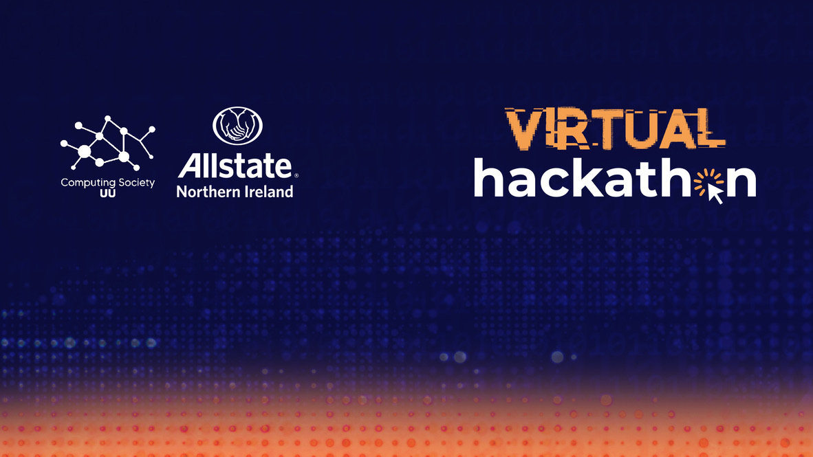

# Allstate UU Coding Challenge - Sample App



## Welcome to the Allstate Coding Challenge

| Section | Description |
| --- | --- |
| [Problem Statement](#problem-statement) | Summary of app requirements |
| [Prerequisites](#prerequisites) | Minimum setup requirements |
| [Getting Started](#getting-started) | Instructions on cloning the sample app repository and starting the application |
| [Useful Information](#useful-information) | General information on how the application is set up in docker |


## :page_facing_up: Problem Statement

An IT company with over 10,000 employees has asked your consultancy firm for help with finding actionable insights in a recent employee study. Since the start of the Covid-19 pandemic they have asked a select group of employees to provide a weekly diary of exercise, home video call, sleep and work times. The task is to create a dashboard to highlight certain changes that could be contributing to poor mental health. Your firm will develop a range of metrics and recommendations for the study group employees. This will help the IT company inform future internal mental health policies. The company has asked that you use React to create this application and have provided you with a dataset from the study.  Your firm will present a demo of the application at the end of the Hackathon.

### Features
- The app will give targeted recommendations based on the amount of time people spend 
 completing activities
- These recommendations will include warnings, hints and celebrating meeting or surpassing 
targets
- There will a final weekly score that will be a good indicator of overall success on 
reaching targets

### Dashboard
- These features will appear as components in a React based dashboard
- The dashboard will have charts of overall statistics of each user
- The dashboard will show the individual recommendations

## :white_check_mark: Prerequisites
If you have any issues, check the troubleshooting guide or ask for
help in the slack channel.  Please ensure you have the following:

1.  GitHub account (you will also need Git installed on your machine)
2.  Docker (Docker Desktop)
3.  Visual Studio Code

## :running: Getting Started

#### Fork the project repo (repository)
Once logged into your GitHub account, fork 
[this repo](https://github.com/HackathonAllUU/allcodingchallenge-sampleapp) by clicking the 
"Fork" button at the top right of the page. This will create a copy of the repo on _your_ 
Github account.

#### Clone the project repo
You can now clone the repo in your Github account which you have just forked. This will allow
you to work on a personal copy of the code.  Open a terminal and navigate to your own home 
directory, or a workspace directory.  The terminal command to clone the repo will be 
something like this:

```
git clone git@github.com:{YOUR-GITHUB-USERNAME}/allcodingchallenge-sampleapp.git
```

#### Browse to project folder

Now, change directory to the newly created project folder:

```
cd allcodingchallenge-sampleapp
```

#### Start the demo application

With docker running, you should now be able to run the cloned sample app in a docker 
container by running the following command:

```
docker-compose up
```

**Notes:**

1.  Docker will pull all the required images to run the app
2.  The first time the images are pulled from DockerHub can take several minutes, please
be patient
3.  A database will be created and populated with sample data
4.  Flask and other requirements will be installed (see [requirements.txt](./server/requirements.txt))
5.  The application will be running at [http://localhost:8080](http://localhost:8080)
6.  If you have MySQL running locally, you may need to stop or kill it as the docker image
uses the default port (see [Troubleshooting guide](./Troubleshooting.md))

#### Stop the application
 
 To cleanly stop the application, either stop it in the Docker Desktop UI, or open a second
 terminal, navigate to the root project folder (allcodingchallenge-sampleapp), and run the
 command:

 ```
docker-compose down
 ```

## :exclamation: Useful Information

The application within docker is split into 3 sections.  Each of these will be separate 
containers within the docker environment:
 
1. Web (for presenting data)
2. Server (for retrieving data)
3. DB (for storing data)


#### Web
#### http://localhost:8080/
The web section houses a React application. Within react App.js is the place where most of the components are placed. The components use a library called Material UI. This offers a quick way of sourcing react components, and they have many that will suit basic web development purposes. The React app also uses functional components and hooks. The two main hooks on offer are useEffect and useState. The components also receive data using 'props', this originates from the parent component. You can organise the data using javascript functions and display it in the component. The React app uses the Axios library to query the Python/Flask back-end.

#### https://material-ui.com/components/selects/
#### https://reactjs.org/docs/hooks-intro.html
 
#### Server (Flask)
#### http://localhost:5000/
The server is a Python Flask server.  It runs a back-end API service that fetches the SQL from the MySQL db and sends back a response that is ultimately used by the React app. The db queries are found in stats_helper.py and the different Flask routes are displayed in application.py. Feel free to create your own routes. 
  
#### DB
The project data is stored in a MySQL database. The database contains two tables:
1) dayroutine - this contains the activities of each employee over a 12 month period
2) employeedata - this is a reference table and provides details on each employee
 
 
 
 
 
 
 
